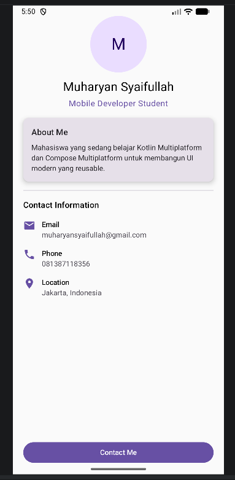

# My Profile App

**Nama:** Muharyan Syaifullah  
**NIM:** 123140045  
**Mata Kuliah:** Pemrograman Aplikasi Mobile  

## Deskripsi
My Profile App adalah aplikasi sederhana berbasis **Kotlin Multiplatform** dan **Compose Multiplatform** yang menampilkan halaman profil pribadi.  
Aplikasi ini dibuat untuk memenuhi Tugas Praktikum Minggu 3 pada mata kuliah **Pemrograman Aplikasi Mobile**.

## Fitur
- Menampilkan foto/inisial profil dan nama
- Menampilkan role atau deskripsi singkat
- Menampilkan bio
- Menampilkan informasi kontak:
  - Email
  - Phone
  - Location
- Menggunakan komponen UI Compose seperti:
  - Column
  - Row
  - Box
  - Card
  - Text
  - Button
  - Icon

## Reusable Composable
Aplikasi ini menggunakan minimal 3 composable function yang reusable, yaitu:
- `ProfileHeader`
- `ProfileCard`
- `InfoItem`

## Teknologi yang Digunakan
- Kotlin Multiplatform
- Compose Multiplatform
- Android Studio

## Screenshot
### Tampilan Aplikasi

## Cara Menjalankan Project
1. Clone repository ini
2. Buka project di **Android Studio**
3. Tunggu proses **Gradle Sync** selesai
4. Jalankan project pada emulator atau device
5. Pastikan project dapat di-build tanpa error

## Struktur Tampilan
Aplikasi menampilkan:
- Header profil
- Bagian About Me
- Bagian Contact Information
- Tombol Contact Me

## Tujuan Pembuatan
Project ini dibuat untuk memahami dasar-dasar **Compose Multiplatform**, terutama:
- pembuatan UI deklaratif
- penggunaan composable function
- penggunaan layout dasar
- penggunaan modifier
- pembuatan komponen reusable
