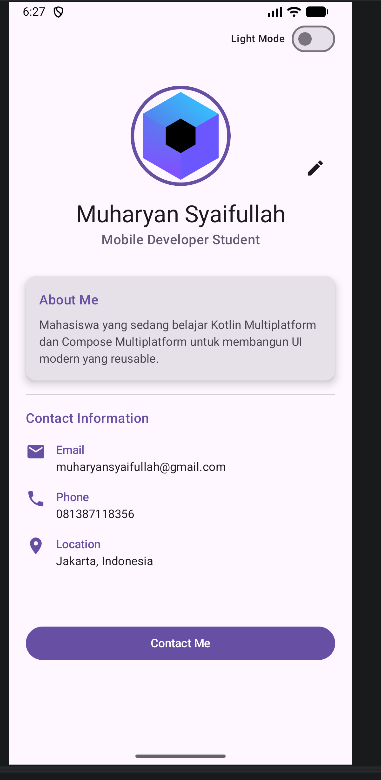
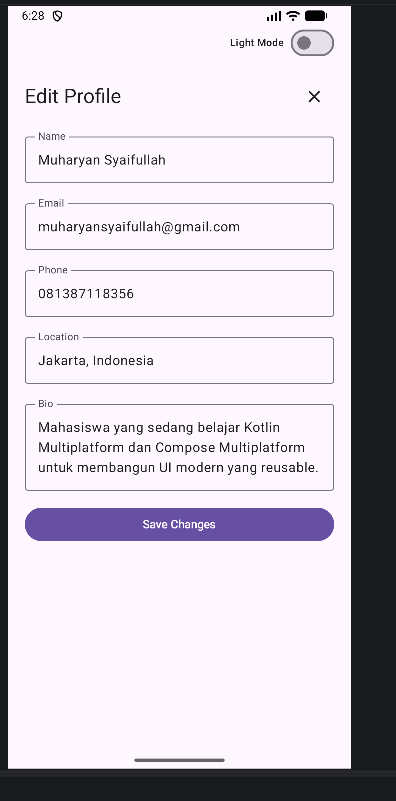
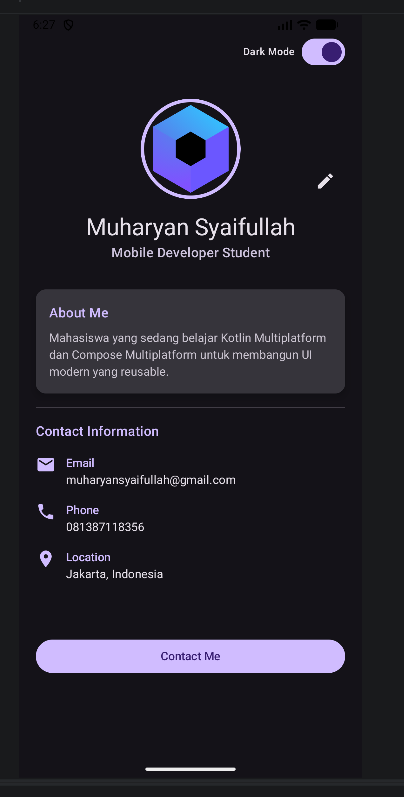

# Tugas 4 - My Profile App with MVVM

**Nama:** Muharyan Syaifullah  
**NIM:** 123140045  
**Mata Kuliah:** Pemrograman Aplikasi Mobile  

## Deskripsi
Project ini merupakan pengembangan dari **My Profile App** pada tugas sebelumnya dengan menerapkan **State Management** dan **MVVM Pattern** menggunakan **Kotlin Multiplatform** dan **Compose Multiplatform**.

Pada tugas ini, aplikasi dikembangkan dengan fitur:
- implementasi **MVVM** menggunakan `ProfileViewModel`
- penggunaan **StateFlow** untuk mengelola UI state
- fitur **Edit Profile** untuk mengubah nama dan bio
- fitur **Dark Mode Toggle**
- penerapan **state hoisting** pada komponen input

## Fitur Utama
- Menampilkan halaman profil
- Menampilkan informasi:
  - Nama
  - Bio
  - Email
  - Phone
  - Location
- Edit profil:
  - Ubah nama
  - Ubah bio
  - Simpan perubahan ke `ViewModel`
- Dark mode:
  - Switch untuk mengubah tema light/dark
- Arsitektur project:
  - `data/`
  - `ui/`
  - `viewmodel/`

## Implementasi MVVM
Project ini menggunakan pola **Model - View - ViewModel**:

### Model / Data
Berisi data class yang digunakan oleh aplikasi, seperti:
- `Profile`
- `ProfileUiState`

### View
Berisi tampilan UI berbasis Compose, seperti:
- `ProfileScreen`
- `EditProfileForm`
- komponen UI lainnya

### ViewModel
Berisi logika pengelolaan state aplikasi, seperti:
- `ProfileViewModel`
- update nama dan bio
- pengaturan dark mode
- expose state ke UI menggunakan `StateFlow`

## State Management
Project ini menerapkan konsep state management dari Compose:
- `StateFlow` di `ViewModel`
- `collectAsState()` di layer UI
- state hoisting pada komponen input
- reactive UI saat data berubah

## Teknologi yang Digunakan
- Kotlin Multiplatform
- Compose Multiplatform
- Android Studio
- StateFlow
- MVVM Architecture

## Screenshot

### Profile View


### Edit Form


### Dark Mode


## Cara Menjalankan Project
1. Clone repository ini
2. Buka project di **Android Studio**
3. Tunggu proses **Gradle Sync** selesai
4. Jalankan project pada emulator atau device
5. Pastikan project dapat di-build tanpa error

## Struktur Folder
Contoh struktur utama project:

```text
data/
ui/
viewmodel/
